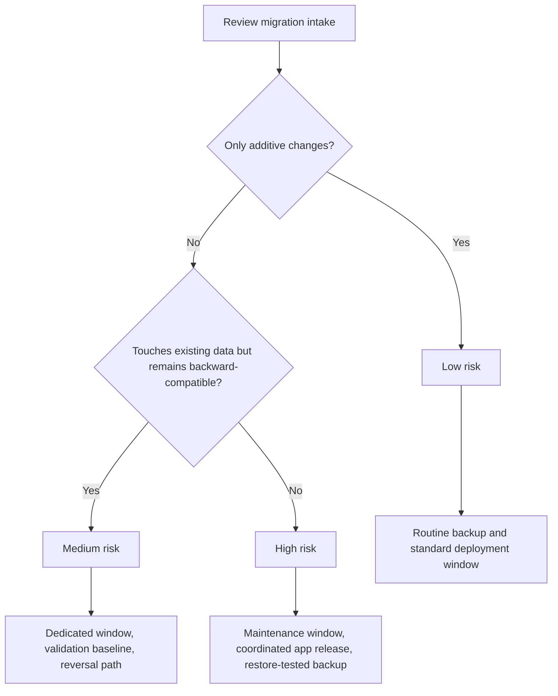
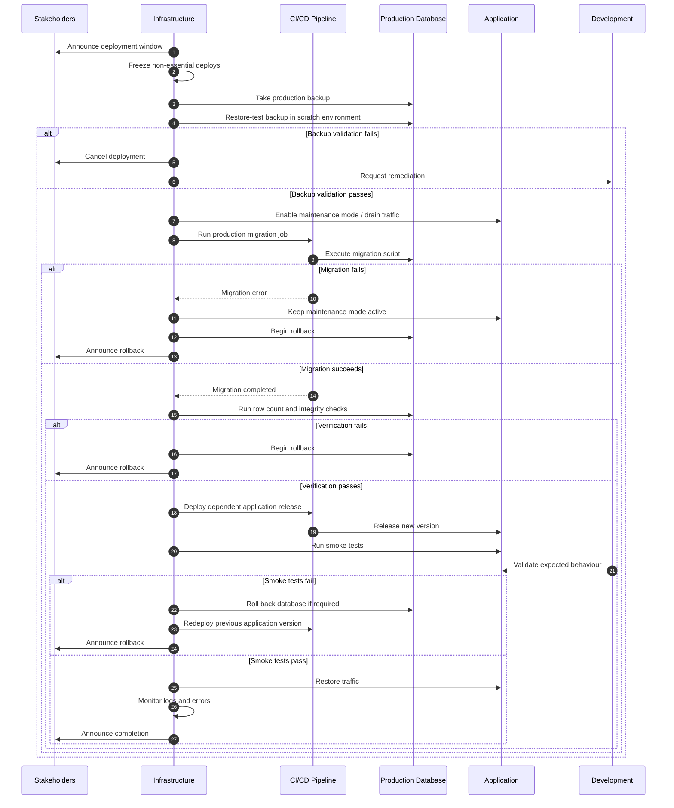
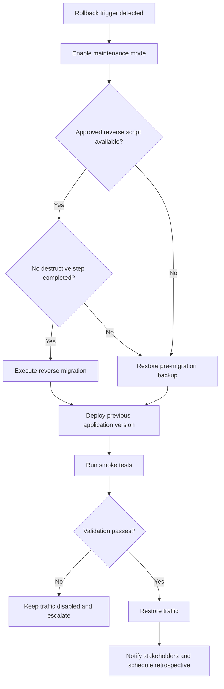

# Patatte Backend Production Migration Deployment Roadmap

> **Scope:** Test → Production schema migration  
> **Status:** Draft — for review  
> **Owner:** Head of Infrastructure, Patatte

---

## 1. Purpose and Ownership

The schema on the test environment has been updated and validated by the development team. A migration script exists to bring production from its current schema to that validated state.

This document does **not** define or evaluate the contents of the migration script. That responsibility remains with the development team.

This roadmap defines the deployment process around the migration:

- What Infrastructure needs before execution
- How the migration is scheduled and rolled out
- How production data is protected
- How the change is verified
- How rollback is handled if something goes wrong

### Ownership split

| Area | Owner | Responsibility |
|---|---|---|
| Migration script | Development | Write, test, and own the correctness of the migration |
| Production execution | Infrastructure | Backup, scheduling, readiness, execution, monitoring, verification, and rollback |
| Application validation | Development + Infrastructure | Confirm application compatibility and verify critical flows |
| Business communication | Infrastructure / Product | Notify internal teams and affected users |

### Key concern

Production contains live data that does not exist on test.

The main risk is therefore not only whether the script runs successfully, but whether running it against production could cause:

- Data loss
- Extended downtime
- Partial or inconsistent state
- Application incompatibility
- A difficult or untested rollback

---

## 2. Intake Requirements From Development

Infrastructure does not schedule a production run until every item below is provided.

| Item | Description | Received? |
|---|---|---|
| Migration script / change set | Exact script(s) or migration files to run against production | [ ] |
| Change summary | Plain-language list of tables, fields, indexes, or constraints being added, changed, or removed | [ ] |
| Breaking vs. additive flag | Identify backward-compatible and non-backward-compatible changes | [ ] |
| Reversal method | Reverse script, restore point, or confirmation that the change is not reversible | [ ] |
| Test-environment confirmation | Confirmation that the migration ran successfully end-to-end on test | [ ] |
| Production-representative volume test | Confirmation that testing used a dataset close to production scale | [ ] |
| Estimated runtime | Expected execution time against production-sized data | [ ] |
| Application dependency notes | Whether the application release must happen before, after, or together with the migration | [ ] |
| Idempotency / resume behavior | Whether the migration can be safely retried or resumed after partial failure | [ ] |
| Table-locking impact | Any operation expected to lock a large table or block writes | [ ] |

> **Gate:** If any required item is incomplete, the migration is not scheduled.

---

## 3. Risk Classification

The migration is classified after the intake review.

| Risk Level | Definition | Deployment Implication |
|---|---|---|
| Low | Purely additive. New tables, nullable columns, indexes, or backward-compatible changes | Standard deployment window, routine backup, normal verification |
| Medium | Backward-compatible, but modifies or backfills existing production data | Dedicated window, pre/post data checks, tested reversal path |
| High | Not backward-compatible while the current application is running | Maintenance window, coordinated app deployment, restore-tested backup, active rollback owner |

**This migration's classification:** `[LOW / MEDIUM / HIGH]`

### Risk decision flow



---

## 4. Pre-Deployment Checklist

### 4.1 Development handoff

- [ ] All intake items in Section 2 are complete
- [ ] Migration script has been reviewed for long-running locks
- [ ] Script is confirmed idempotent or safe to resume
- [ ] Application dependency order is agreed
- [ ] Development contact is available during deployment

### 4.2 Data safety

- [ ] Full production backup taken
- [ ] Backup restored successfully into a scratch environment
- [ ] Pre-migration row counts captured for affected tables
- [ ] Checksums or equivalent validation captured where appropriate
- [ ] Point-in-time recovery window confirmed
- [ ] Backup retention period confirmed

### 4.3 Environment readiness

- [ ] Production DB engine and version match the tested environment
- [ ] Migration pipeline has been dry-run against non-production
- [ ] Maintenance mode or traffic-draining mechanism is confirmed
- [ ] Previous known-good application release is available
- [ ] Monitoring dashboards and logs are ready

### 4.4 People and communication

- [ ] Deployment window scheduled
- [ ] Stakeholders informed
- [ ] Rollback owner assigned: `[Name]`
- [ ] Development standby contact assigned: `[Name]`
- [ ] Final go/no-go owner assigned: `[Name]`

---

## 5. Backup and Recovery Strategy

### 5.1 Pre-migration backup

Take the backup immediately before the deployment window begins.

The backup must:

- Use the database platform's native snapshot or dump mechanism
- Be copied away from the primary database host
- Be restore-tested against a scratch environment
- Be retained for at least `[30] days`

### 5.2 Point-in-time recovery

Record the available recovery window:

**PITR window:** `[X hours / days]`

When point-in-time recovery is unavailable, the pre-migration backup becomes the only guaranteed recovery point. Risk classification should be adjusted accordingly.

### 5.3 Rollback triggers

Rollback should begin when any of the following occurs:

- The migration exits with an error
- Runtime exceeds the agreed estimate plus buffer
- Verification checks fail
- Unexpected nulls or orphaned records appear
- Application error rate exceeds the agreed threshold
- Critical user flows fail
- A partial or inconsistent migration state is detected

---

## 6. Rollout Plan

### 6.1 Deployment timeline

| Step | Action | Owner | Estimated Duration |
|---|---|---|---|
| 1 | Freeze non-essential production deployments | Infrastructure | — |
| 2 | Announce deployment window start | Infrastructure | 5 min |
| 3 | Take and verify pre-migration backup | Infrastructure | `[X min]` |
| 4 | Enable maintenance mode or drain traffic, if required | Infrastructure | 2 min |
| 5 | Execute migration through the deployment pipeline | Infrastructure | `[X min]` |
| 6 | Run post-migration data verification | Infrastructure | 10 min |
| 7 | Deploy dependent application release, if applicable | Infrastructure | `[X min]` |
| 8 | Run smoke tests on critical flows | Infrastructure + Development | 15 min |
| 9 | Restore traffic / disable maintenance mode | Infrastructure | 2 min |
| 10 | Monitor logs, errors, and system health | Infrastructure | 30–60 min |
| 11 | Announce completion | Infrastructure | 5 min |

### 6.2 Deployment swimlane



### 6.3 Execution rule

The migration is executed exactly as supplied by Development through the standard deployment pipeline.

Infrastructure must not alter the migration content during the production window.

Example placeholder:

```bash
deployment-pipeline run migration \
  --target=production \
  --env=patatte-prod
```

The pipeline must stop immediately if the migration step fails. It must not continue automatically to the application deployment step.

### 6.4 Post-migration verification

Before restoring production traffic:

- [ ] Row counts match the pre-migration baseline, except for expected changes
- [ ] Backfilled or transformed columns are spot-checked
- [ ] No unexpected null values exist
- [ ] Foreign-key and relational integrity checks pass
- [ ] No orphaned records exist
- [ ] Application logs show no new critical errors

### 6.5 Patatte smoke-test checklist

Critical flows should include:

- [ ] User login
- [ ] Menu retrieval
- [ ] Order creation
- [ ] Payment confirmation
- [ ] Order status update
- [ ] Kitchen order visibility
- [ ] Vendor fulfilment update
- [ ] Organisation confirmation / receipt flow
- [ ] Notification delivery
- [ ] Reporting or reconciliation visibility

---

## 7. Rollback Procedure

When a rollback trigger is hit, do not patch forward under pressure.

1. Re-enable maintenance mode or drain traffic immediately.
2. Stop the deployment pipeline.
3. Determine whether a safe reverse migration is available.
4. If a reverse script is approved and destructive steps have not run, execute it.
5. Otherwise, restore the pre-migration backup.
6. Validate the restored database in a scratch or replacement environment.
7. Cut production over to the restored database if required.
8. Redeploy the previous known-good application release.
9. Re-run smoke tests.
10. Restore traffic only after validation passes.
11. Inform stakeholders that the rollback is complete.
12. Schedule a retrospective before attempting the migration again.

### Rollback decision flow



---

## 8. Communication Plan

| When | Audience | Channel | Message |
|---|---|---|---|
| T-2 days | Stakeholders | `[channel]` | Deployment scheduled for `[date/time]`; expected downtime `[X min / none]` |
| T-1 hour | Internal team | `[channel]` | Final go/no-go confirmation; backup and owners verified |
| T-0 start | Users, if downtime is expected | Status page / in-app banner | Maintenance in progress |
| T-0 end | Stakeholders | `[channel]` | Deployment complete; systems verified |
| If rollback | Stakeholders | `[channel]` | Issue encountered; system restored to previous state; follow-up review scheduled |

---

## 9. Sign-Off

The migration must not run against production until all sign-off items are complete.

| Item | Confirmed By | Date |
|---|---|---|
| Development intake complete |  |  |
| Risk classification agreed |  |  |
| Backup taken and restore-tested |  |  |
| Deployment window communicated |  |  |
| Rollback owner assigned |  |  |
| Development standby confirmed |  |  |
| Final go-ahead |  |  |

---

## Appendix

Attach or link the following supporting materials:

- Migration script or change files
- Pre-migration schema snapshot
- Development test-run confirmation
- Production backup reference
- Verification query set
- Smoke-test evidence
- Rollback evidence, if rollback occurs
- Post-deployment monitoring notes
